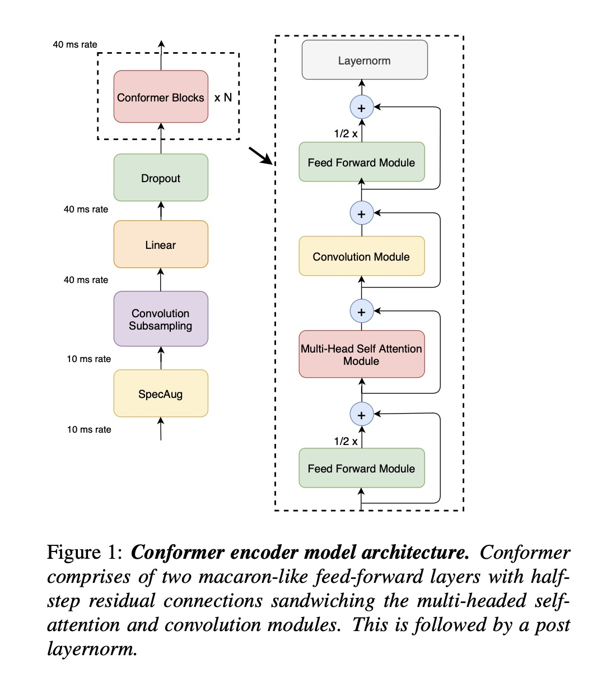

# Conformer: Paper Replication



Implementation of **"Conformer: Convolution-augmented Transformer for Speech Recognition"**
(Gulati et al., Google, 2020 — arXiv:2005.08100)


---

## The Core Equation (paper Section 2.4)

$$\tilde{x}_i = x_i + \frac{1}{2}\text{FFN}(x_i)$$

$$x'_i = \tilde{x}_i + \text{MHSA}(\tilde{x}_i)$$

$$x''_i = x'_i + \text{Conv}(x'_i)$$

$$y_i = \text{LayerNorm}\!\left(x''_i + \frac{1}{2}\text{FFN}(x''_i)\right)$$

---

## Quick Start

```python
from modules.conformer_encoder import build_conformer
import torch

model = build_conformer("S")   # 10M params, Conformer-S

# Simulate a batch: 4 utterances, 200 frames, 80 filterbank channels
x = torch.randn(4, 200, 80)
out = model(x)
print(out.shape)   # (4, ~50, 144)
```

---

## Training

Run the training script to train a small Conformer Transducer on toy data.

```bash
python train.py
```

Example output:
```text
Epoch    Step      Loss            LR  Sample Decode
    1      13  110.6365      2.63e-05  ''
   10     130   31.3585      2.63e-04  'or moration'
   20     260    1.8326      2.58e-04  'conformermalio'
   30     390    0.0469      2.11e-04  'hello world'
   50     650    0.0023      1.63e-04  'convolutionlayeralatio'

Final loss: 0.0023
Checkpoint saved to: conformer_s.pt
```

Loss curve visualization:
```text
  110.637 |█                                                 
  82.978  |█                                                 
  55.319  |██                                                
  27.661  |████                                              
  0.002   |██████████████████████████████████████████████████
          epoch 1                                  epoch 50
```

---

## Model Sizes

| Model | d_model | Heads | Layers | Params | LibriSpeech WER |
|-------|---------|-------|--------|--------|----------------|
| Conformer-S | 144 | 4 | 16 | 10.3M | 2.7% / 6.3% |
| Conformer-M | 256 | 4 | 16 | 30.7M | 2.3% / 5.0% |
| Conformer-L | 512 | 8 | 17 | 118.8M | 2.1% / 4.3% |

WER = Word Error Rate on LibriSpeech test-clean / test-other (no language model)

---

## Run Each Module

```bash
cd modules/

python feed_forward.py       # Test FFN
python attention.py          # Test MHSA
python convolution.py        # Test Conv module
python conformer_block.py    # Test full block
python conformer_encoder.py  # Test full encoder
```

---

## Documentation

Detailed documentation for each module:
1. [Feed-Forward Module](docs/01_feed_forward.md)
2. [Multi-Head Self-Attention](docs/02_attention.md)
3. [Convolution Module](docs/03_convolution.md)
4. [Conformer Block](docs/04_conformer_block.md)
5. [Conformer Encoder](docs/05_conformer_encoder.md)
6. [Decoder Module](docs/06_decoder.md)
7. [Joint Module](docs/07_joint.md)
8. [Conformer Transducer](docs/08_conformer_transducer.md)
9. [Dataset and Dataloader](docs/09_dataset.md)
10. [Training Logic](docs/10_training.md)

---

## Key Design Choices vs. Vanilla Transformer

| Feature | Transformer | Conformer |
|---------|-------------|-----------|
| Local features | ✗ | ✓ Depthwise conv |
| Global context | ✓ | ✓ Self-attention |
| Positional encoding | Absolute (sinusoidal) | Relative (Transformer-XL) |
| FFN placement | Single, after attention | Macaron pair (before + after) |
| FFN residual | Full (×1) | Half (×0.5) each |
| Activation | ReLU | Swish |
| Conv gating | — | GLU |

---

## Dependencies

```
torch >= 2.0
```

Install:
```bash
pip install torch
```

---

## Validation

Validate the implementation against pretrained weights from NeMo or Sherpa-ONNX.

### 1. NeMo Validation
Requires .nemo or .ckpt file.
```bash
./venv/bin/python validate_conformer.py --nemo_path stt_en_conformer_ctc_small.nemo --rel_attention
```

### 2. Sherpa-ONNX Validation
Requires .onnx file.
```bash
./venv/bin/python validate_sherpa.py --rel_attention
```

Options:
--rel_attention: Use the Relative Multi-Head Self-Attention module.
--nemo_path: Path to the .nemo tarball or raw .ckpt weight file.
--onnx_path: Path to the Sherpa encoder .onnx file.

---

## Reference

```bibtex
@article{gulati2020conformer,
  title   = {Conformer: Convolution-augmented Transformer for Speech Recognition},
  author  = {Gulati, Anmol and Qin, James and Chiu, Chung-Cheng and Parmar, Niki
             and Zhang, Yu and Yu, Jiahui and Han, Wei and Wang, Shibo and
             Zhang, Zhengdong and Wu, Yonghui and Pang, Ruoming},
  journal = {arXiv preprint arXiv:2005.08100},
  year    = {2020}
}
```
